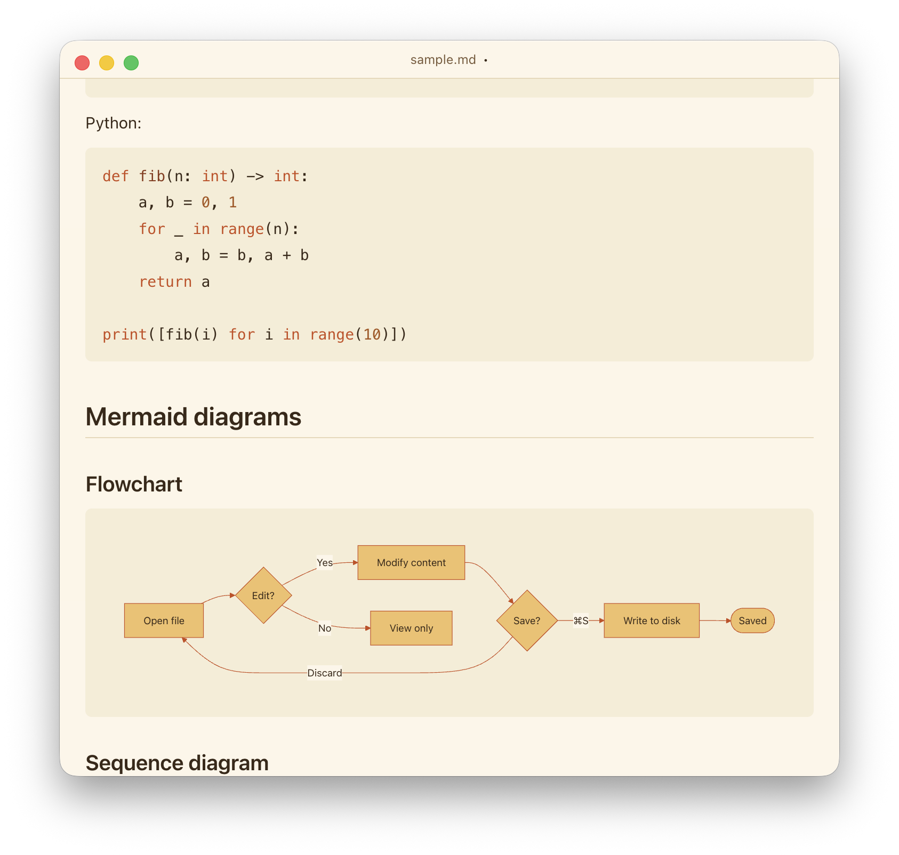

# markdownpad

A focused, Notepad-inspired markdown editor for macOS. Open, edit, save markdown files. Nothing else.

  
  

## Features

- Open, edit, and save `.md` / `.markdown` files
- Right-click anywhere in the document (or `⇧⌘P`) to flip between **edit** and **view** modes
- View mode renders GitHub-flavored markdown — including tables, footnotes, syntax-highlighted code, and **mermaid diagrams**
- Images render in view mode — both relative paths (``) resolved against the open document's directory and external `https://…` URLs
- Interactive task-list checkboxes — click them in view mode to toggle
- Print the rendered document (`⌘P`) — ink-friendly light styling, page breaks that keep code blocks, tables, and diagrams intact
- Multi-window — `⌘N` opens a new editor; closing with unsaved changes prompts you
- Reopens the documents you had open the last time you quit
- Light, Dark, and System appearance, plus 5 unified theme packs (Plain, Forest, Midnight, Solar Flare, Cherry) that style the app, code highlighting, and mermaid diagrams together — `⌘T` cycles
- Native macOS chrome with traffic lights, File menu, Open Recent, file-association for `.md`

## Themes

[Live preview](https://max-rousseau.github.io/markdownpad/themes.html) of all five theme packs — Plain, Forest, Midnight, Solar Flare, Cherry — each in light and dark modes.

## Install

Download the latest `.dmg` from the [Releases](../../releases) page, open it, and drag **markdownpad** into Applications.

## Keyboard shortcuts

| Action                  | Shortcut             |
| ----------------------- | -------------------- |
| New window              | `⌘N`                 |
| Open…                   | `⌘O`                 |
| Save                    | `⌘S`                 |
| Save As…                | `⇧⌘S`                |
| Print…                  | `⌘P`                 |
| Toggle edit / view      | `⇧⌘P` or right-click |
| Cycle theme pack        | `⌘T`                 |
| Zoom in / out           | `⇧⌘=` / `⇧⌘-`        |
| Reset zoom              | `⌘0`                 |
| Close window            | `⌘W`                 |
| Quit                    | `⌘Q`                 |
