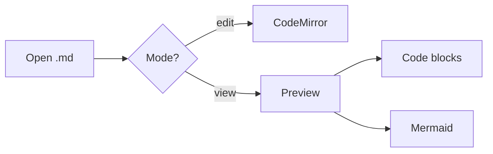

# The render pipeline

A small markdown doc, sized to fit in a screenshot. It exists so the README screenshots show off code and diagrams in the same frame.

## Toggling a checkbox

Click any task-list item in **view mode** to flip it — markdownpad rewrites the source.

- [x] Edit mode (CodeMirror)
- [x] View mode (react-markdown)
- [ ] Auto-update channel

## Sample code

```ts
type Mode = 'edit' | 'view'

function toggle(m: Mode): Mode {
  return m === 'edit' ? 'view' : 'edit'
}
```

## Sample diagram


