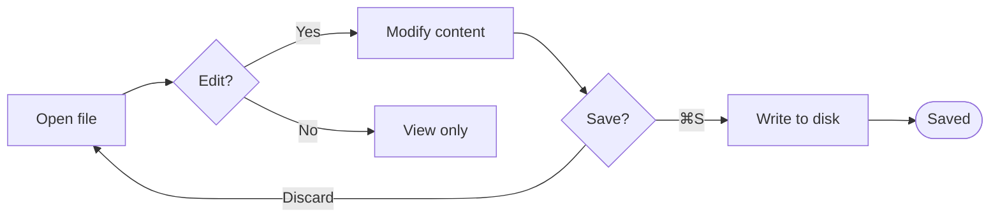
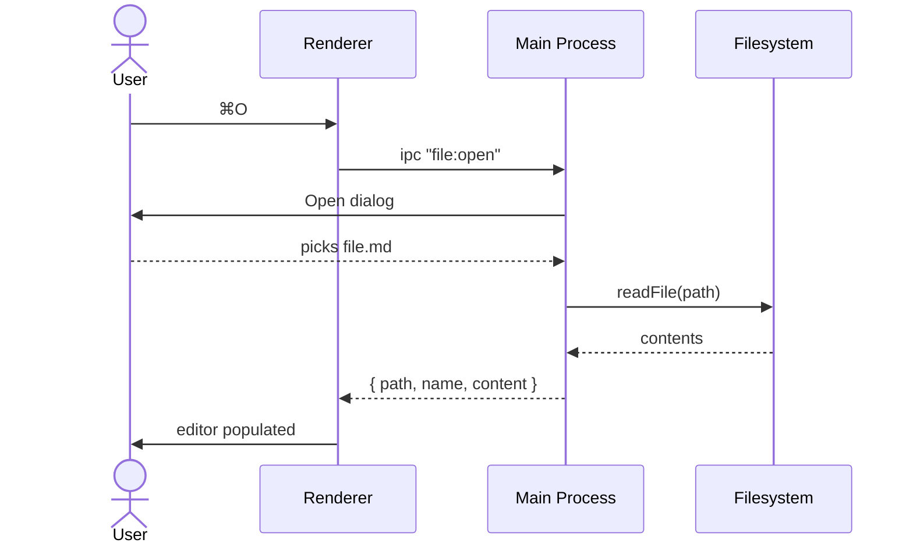
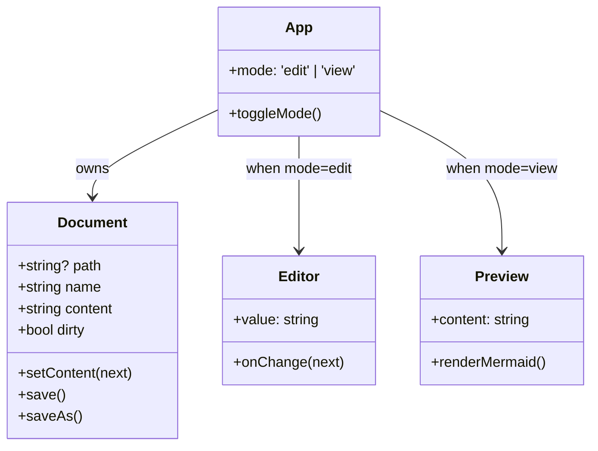
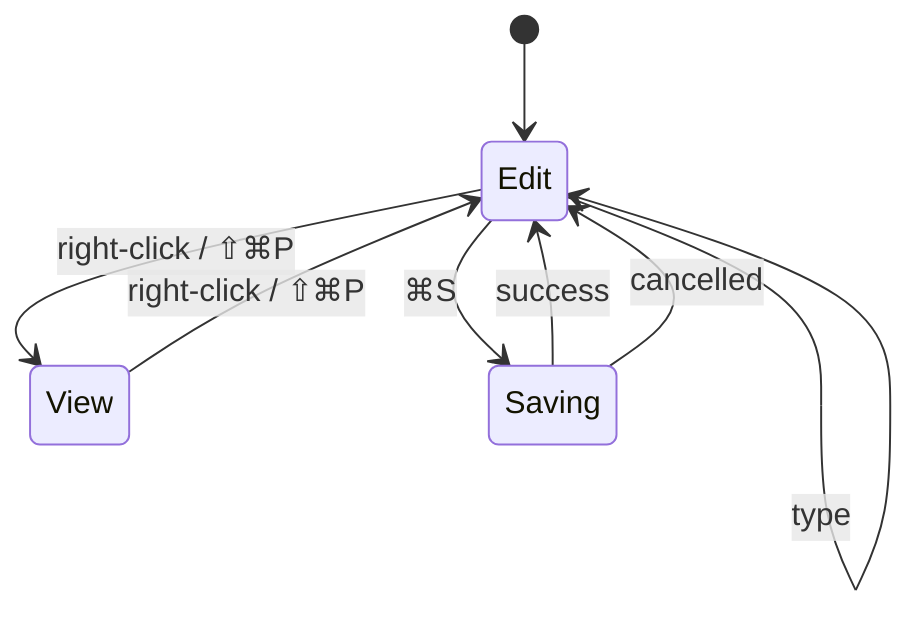
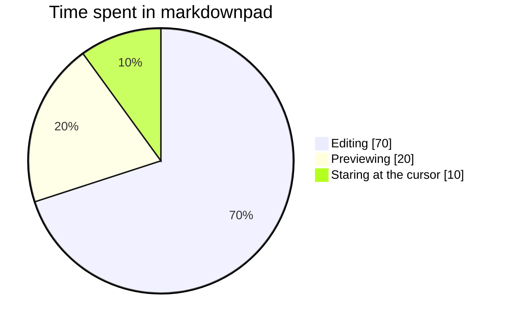
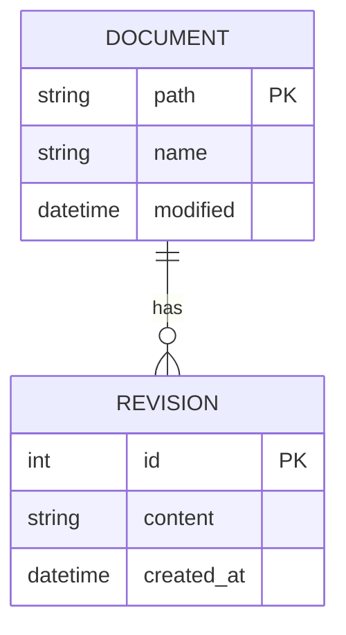
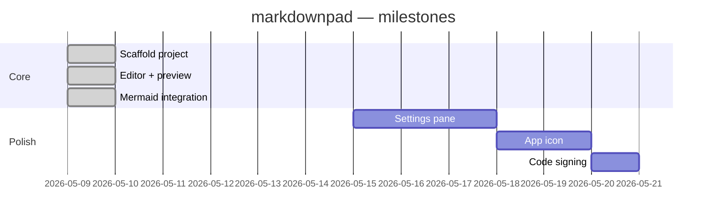
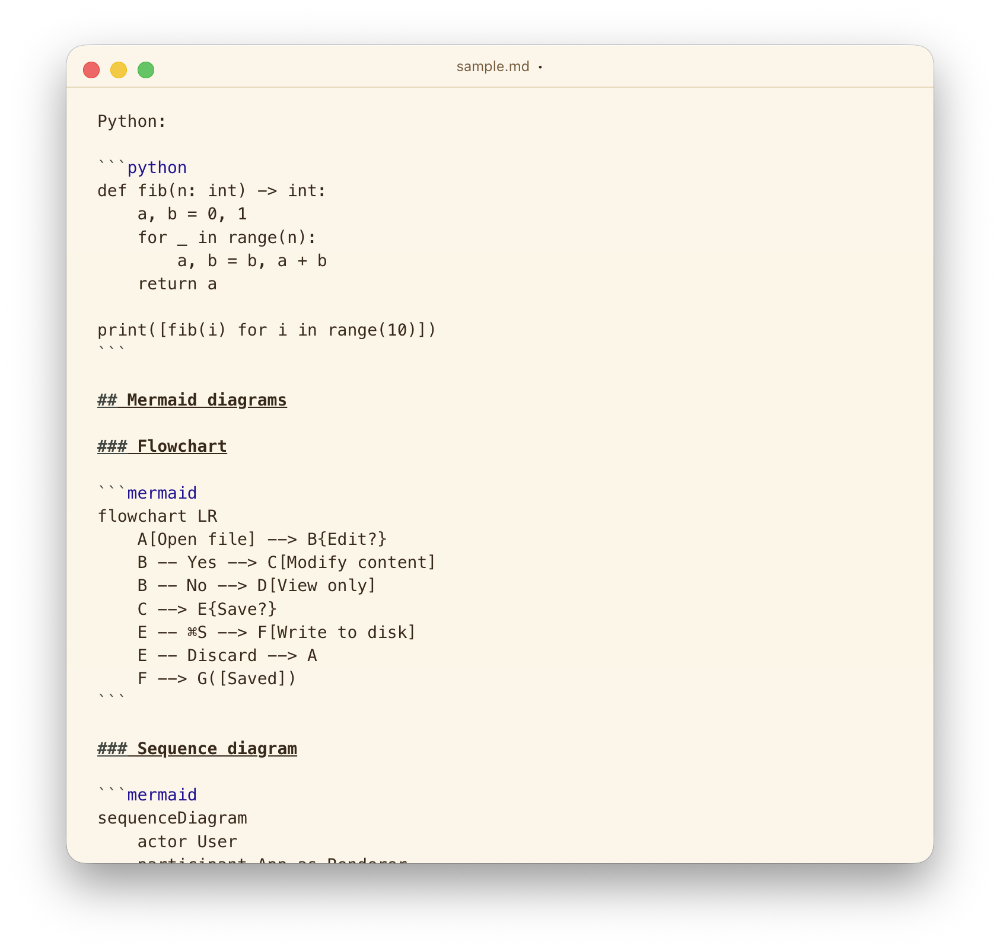

# sample.md

A test document for **markdownpad**. Right-click the pane to switch between edit and view modes.

## Inline formatting

This paragraph mixes *italic*, **bold**, ***bold italic***, `inline code`, ~~strikethrough~~, and a [link to anthropic](https://www.anthropic.com). Here's a footnote-style reference for keyboard shortcuts: try `⇧⌘P`.

Hard line break below this line.
And a soft wrap continues this sentence on the next visual row when the window is narrow enough — markdown joins it into one paragraph.

---

## Headings

# H1 — Largest
## H2 — Section
### H3 — Subsection
#### H4 — Sub-subsection
##### H5
###### H6

## Lists

Unordered:

- First item
- Second item
  - Nested child
  - Another nested child
    - Deeper still
- Third item

Ordered:

1. Wake up
2. Open markdownpad
3. Write something
4. Save with `⌘S`

Task list (GFM):

- [x] Wire up CodeMirror
- [x] Render mermaid diagrams
- [ ] Add syntax highlighting to code blocks
- [ ] Add a settings pane

## Blockquotes

> A quote on its own line.
>
> > Nested quotes are a thing.
> > They cascade visually.
>
> Back to the outer quote.

## Tables

| Shortcut | Action          | Notes                                |
| -------- | --------------- | ------------------------------------ |
| `⌘N`     | New file        | Discards current with confirmation   |
| `⌘O`     | Open…           | `.md` and `.markdown` filters        |
| `⌘S`     | Save            | Falls back to Save As if untitled    |
| `⇧⌘S`    | Save As…        | Always prompts for path              |
| `⇧⌘P`    | Toggle view     | Same as right-click on the pane      |

Alignment:

| Left  | Center | Right |
| :---- | :----: | ----: |
| a     |   b    |     c |
| 1     |   22   |   333 |

## Code blocks

Plain (no language):

```
echo "no language tag — plain block"
```

Bash:

```bash
#!/usr/bin/env bash
set -euo pipefail
for f in *.md; do
  printf "found: %s\n" "$f"
done
```

TypeScript:

```ts
type Mode = 'edit' | 'view'

function toggle(m: Mode): Mode {
  return m === 'edit' ? 'view' : 'edit'
}
```

Python:

```python
def fib(n: int) -> int:
    a, b = 0, 1
    for _ in range(n):
        a, b = b, a + b
    return a

print([fib(i) for i in range(10)])
```

JSON:

```json
{
  "name": "markdownpad",
  "version": "0.1.0",
  "license": "BSD-3-Clause"
}
```

## Mermaid diagrams

### Flowchart



### Sequence diagram



### Class diagram



### State diagram



### Pie chart



### Entity-relationship diagram



### Gantt



## Images

Relative path (resolves against the markdown file's directory):



External HTTPS URL (requires network):


Missing image (broken-image fallback):


Inline image in a sentence: here is a small icon  sitting in flow.

## Edge cases

Empty heading anchor target:

###

A paragraph with **bold _and italic_ inside** plus a `code span containing | a pipe` and an inline image emoji-like marker (no actual image to keep the test self-contained).

A line with just text, immediately followed by a list:

- continues
- without a blank line — most renderers tolerate this

Escaped characters: \* not italic \*, \`not code\`, \\ literal backslash.

---

End of sample.
